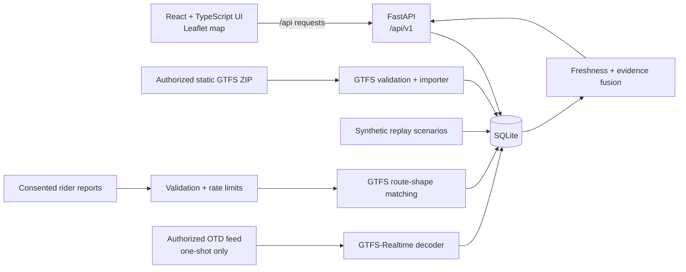

# Raahi — Delhi Transit

**A transit information dashboard and versioned API for Delhi bus routes, stops, schedules, and vehicle-location evidence.**

[Open the live app](https://raahi-q3sr.onrender.com/) · [API health](https://raahi-q3sr.onrender.com/api/v1/health) · [Interactive API reference](https://raahi-q3sr.onrender.com/docs)

## What it does

- Displays routes, stops, and current position evidence on a Leaflet map.
- Labels position state, age, source, route-match status, contributor count, and confidence instead of presenting every location as equally certain.
- Offers five synthetic scenarios to show normal coverage, crowd agreement, sparse data, stale positions, and conflicting reports.
- Lists upcoming schedule-based arrivals and labels them as estimates derived from static GTFS schedule data.
- Accepts opt-in, consented rider reports for positions, delays, traffic, breakdowns, and crowding.
- Imports a locally supplied static GTFS ZIP into SQLite.
- Includes a guarded, one-request OTD GTFS-Realtime adapter for an operator who has been authorized to use it.

There is no booking or payment flow. The source data available to this project supports transit information and location evidence, not ticket inventory or reservations.

## Architecture



### Request and data flow

1. A static GTFS ZIP is parsed and checked for required files, columns, identifiers, and cross-file references. A valid snapshot is written transactionally to SQLite with source, retrieval, attribution, and archive-hash metadata.
2. The API reads routes, stops, schedules, and the newest position evidence from SQLite. Startup does not fetch operator data.
3. Synthetic replay fixtures seed the demo network and can be switched from the UI. Synthetic rows are explicitly marked and surfaced as simulated.
4. A rider report requires explicit consent and a timezone-aware observation time. The service hashes the ephemeral contributor token, rejects invalid or implausible submissions, matches coordinates to route shapes where possible, and expires reports after 30 minutes.
5. The fusion layer groups independent, recent reports. A crowd-only cluster needs multiple contributors and remains provisional and unidentified. Crowd evidence can corroborate a fresh official position, but it cannot move the official position. Old observations are marked stale; conflicts remain visible as disagreement evidence.
6. The optional OTD adapter decodes a GTFS-Realtime VehiclePositions snapshot when an authorized operator explicitly triggers a single fetch. It has no background polling loop. Live operation requires prior OTD access approval and an issued key.

### Design decisions

- **Separate scheduled time from live location.** GTFS stop times produce schedule estimates, not arrival predictions. The API labels them `scheduled_estimate` and includes the static-feed basis.
- **Make evidence visible.** Responses include source, observed/received timestamps, age, freshness, route match, confidence, contributor count, and disagreement when applicable.
- **Keep weak evidence weak.** A lone crowd report is not treated as a bus location; crowd-only clusters have no physical vehicle identity. Matching a point to a route shape is a plausibility check, not proof that a bus was seen.
- **Require consent and minimize contributor data.** The API stores a digest of a random token, not the token itself or account/contact details. Reports are short-lived and rate-limited.
- **Do not guess operator access rules.** The live-feed code is opt-in, restricted to the documented OTD endpoint, token-protected, size-limited, and one-shot. Polling cadence, retention, and redistribution need operator approval before live use.
- **Use synthetic data for a reproducible demo.** The scenario fixtures demonstrate how confidence and freshness behave without implying access to actual vehicle positions.
- **Keep the service compact.** FastAPI and SQLite keep local setup and deployment straightforward; the API and browser UI can also be run independently during development.

## API reference

All application endpoints use the `/api/v1` prefix. Successful responses are JSON unless noted. Query limits are bounded by the API; schemas reject unexpected request fields.

### System

| Method and path | Purpose |
|---|---|
| `GET /api/v1/health` | Service, tracking mode, and database health. |
| `GET /api/v1/meta` | Current mode, source attribution, retrieval metadata, and operating limitations. |

### Network and schedules

| Method and path | Query / behavior |
|---|---|
| `GET /api/v1/routes` | Optional `q` search and `limit` (1–100). |
| `GET /api/v1/routes/{route_id}` | Details for one route. |
| `GET /api/v1/stops` | Optional `q`; or `latitude`, `longitude`, and `radius_m` for nearest-first results. Coordinates must be supplied together. `limit` is 1–100. |
| `GET /api/v1/stops/{stop_id}` | Details for one stop. |
| `GET /api/v1/stops/{stop_id}/arrivals` | Upcoming static schedule estimates, up to 24 hours; `limit` is 1–50. No real-time ETA is claimed. |

### Vehicle locations

| Method and path | Purpose |
|---|---|
| `GET /api/v1/routes/{route_id}/vehicles` | Fused positions for one route, including live, provisional, stale, or simulated status as applicable. |
| `GET /api/v1/vehicles/{vehicle_id}` | One identified vehicle state. Anonymous crowd clusters do not receive a physical vehicle ID. |

### Rider reports

| Method and path | Purpose |
|---|---|
| `POST /api/v1/crowd/reports` | Submit a consented report. Body fields: `consent`, `report_type` (`position`, `traffic`, `delay`, `breakdown`, or `crowding`), `latitude`, `longitude`, timezone-aware `observed_at`, random `contributor_token`, and optional `route_id` / `vehicle_id`. Returns the report ID, expiration, and route-match result. |
| `DELETE /api/v1/crowd/reports/{report_id}` | Moderator deletion; requires `X-Reports-Admin-Token` and server-side `REPORTS_ADMIN_TOKEN`. Returns `204`. |

Reports older than 15 minutes, more than two minutes in the future, duplicate submissions within ten seconds, rates above five per minute per token, and implausible jumps above 120 km/h are rejected. A report more than 150 metres from a route shape is not marked as matched. A supplied route that conflicts with a nearby shape match is rejected. The random token is SHA-256 hashed before storage and expires with report retention.

### Synthetic scenarios

| Method and path | Purpose |
|---|---|
| `GET /api/v1/demo/scenarios` | List available scenario presets and the active preset. Available only for the seeded synthetic network in simulated mode. |
| `POST /api/v1/demo/scenarios/{scenario_id}` | Switch the synthetic network to `baseline`, `weekday-rush`, `crowd-consensus`, `sparse-coverage`, or `route-disagreement`. |

### Authorized OTD fetch

| Method and path | Purpose |
|---|---|
| `POST /api/v1/admin/official-feed/fetch` | Explicitly request one OTD GTFS-Realtime positions snapshot. Requires `X-Reports-Admin-Token`, `TRACKING_MODE=live`, `OTD_ACCESS_APPROVED=true`, and an OTD-issued `OTD_API_KEY`. There is no timer or automatic polling. |

Interactive OpenAPI documentation is available at `/docs`; its schema is generated from the request and response models in `app/schemas.py`.

## Codebase guide

```text
app/
  main.py           Application factory, system endpoints, static UI mount, demo controls
  config.py         Environment settings and live-mode safety checks
  schemas.py        Strict request and response models
  gtfs.py           Static GTFS ZIP parsing and validation
  ingest.py         Command-line static-feed importer
  storage.py        SQLite schema, feed transactions, and observation storage
  tracking.py       Read APIs, schedule estimates, vehicle lookups, one-shot OTD fetch
  crowd.py          Consent, report validation, retention, and moderator deletion
  matcher.py        Nearest GTFS route-shape segment matching
  fusion.py         Position grouping, source combination, freshness, and confidence
  official_feed.py  OTD HTTP client and GTFS-Realtime protobuf decoder
  replay.py         Synthetic network, scenarios, and replay seeding
web/
  src/App.tsx       Dashboard, map, search, scenario selector, arrivals, report flow
  src/main.tsx      React entry point and Leaflet CSS setup
  src/styles.css    Light/dark themes and responsive layout
  vite.config.ts    Development proxy from /api to FastAPI on port 8000
tests/
  test_app.py test_crowd.py test_demo.py test_fusion.py
  test_gtfs.py test_official_feed.py test_tracking.py
scripts/
  check_replay.py   End-to-end checks against a locally running demo service
docs/
  source-notes.md   Data-source and authorization research notes
Dockerfile          Multi-stage build for the browser bundle and Python service
render.yaml         Render Blueprint configuration
pyproject.toml      Python package, runtime dependencies, and test/lint settings
```

## Run locally

### Requirements

- Python 3.12+
- Node.js 22 (or a compatible current LTS release) and npm
- Internet access for OpenStreetMap tiles and the optional hosted font

### Start the API

From the repository root:

```bash
python3 -m venv .venv
source .venv/bin/activate
python -m pip install -e '.[dev]'
python -m app.replay --database data/transit.sqlite3 --scenario weekday-rush
uvicorn app.main:app --reload --host 127.0.0.1 --port 8000
```

### Start the web interface

In a second terminal:

```bash
cd web
npm ci
npm run dev
```

Open <http://localhost:5173>. Vite forwards `/api/*` requests to FastAPI on port 8000. Alternatively, build the browser bundle with `cd web && npm run build`, then start FastAPI; it serves `web/dist` at the root URL when the build directory exists.

### Try the API

```bash
curl http://localhost:8000/api/v1/health
curl http://localhost:8000/api/v1/routes
curl http://localhost:8000/api/v1/stops
curl http://localhost:8000/api/v1/routes/DEMO-REPLAY-1/vehicles
curl http://localhost:8000/api/v1/demo/scenarios
```

The local replay defaults to the `weekday-rush` fixture. Switch scenario using the UI or `POST /api/v1/demo/scenarios/{scenario_id}`.

## Import an authorized static GTFS feed

Obtain a ZIP through an authorized source and follow its attribution terms. The importer does not download a feed:

```bash
python -m app.ingest /path/to/authorized-static-feed.zip --database data/transit.sqlite3
```

The importer validates the archive and replaces the database's active feed snapshot in a transaction. Source notes, retrieval time, attribution, archive hash, and available version dates are retained with the imported feed.

## Configuration and deployment

The application reads process environment variables; it does not automatically load `.env`. See `.env.example` for names and defaults. Relevant settings:

| Variable | Default | Notes |
|---|---|---|
| `TRACKING_MODE` | `simulated` | `live` is rejected unless the authorization flag and key are present. |
| `DATABASE_PATH` | `data/transit.sqlite3` | SQLite path. Render uses `/tmp/raahi/transit.sqlite3`. |
| `APP_NAME` | `Delhi Transit Tracker API` | Service name shown by health and metadata. |
| `LOG_LEVEL` | `INFO` | Standard logging severity. |
| `OTD_ACCESS_APPROVED` | `false` | Set true only after OTD explicitly grants access. |
| `OTD_API_KEY` | unset | OTD-issued key; server-side only. Never commit or expose it to the browser. |
| `OTD_FEED_URL` | documented OTD positions URL | Configuration only accepts the HTTPS OTD VehiclePositions endpoint. |
| `OTD_REQUEST_TIMEOUT_SECONDS` | `10` | One-shot request timeout. |
| `REPORTS_ADMIN_TOKEN` | unset | Optional server-only credential for moderation and the one-shot feed fetch endpoint. |
| `DATA_ATTRIBUTION` | Delhi Open Transit Data (OTD) | Source attribution returned in metadata. |

The repository includes a Dockerfile and Render Blueprint. Render serves both the built UI and API from one web service. The current deployment uses the free plan, so it may suspend while idle and the filesystem is ephemeral; its demo scenario is seeded when the service starts. The live URL above may take a little while to wake after inactivity.

## Checks

Run the suite from the repository root:

```bash
pytest
```

The tests cover GTFS validation/import and rollback, API contracts, schedule labels, report consent and limits, shape matching, evidence fusion, freshness states, synthetic scenarios, OTD protobuf decoding, mocked HTTP behavior, and authorization/configuration guards. They use local fixtures and HTTP mocks; they do not contact OTD or establish real-world location accuracy.

## Map, attribution, and limitations

The map uses OpenStreetMap tiles and displays the required attribution. Tile availability and font loading require an internet connection. Browser geolocation is requested only after the user chooses a location action. It is not enabled automatically.

The deployed view is a product/demo surface backed by synthetic positions and schedule data; it should not be used to plan a real journey. Real live positions require operator authorization, a permitted feed key, and confirmation of access, polling, retention, and redistribution terms. Static schedules do not provide live arrival estimates, and no booking capability is implemented.
